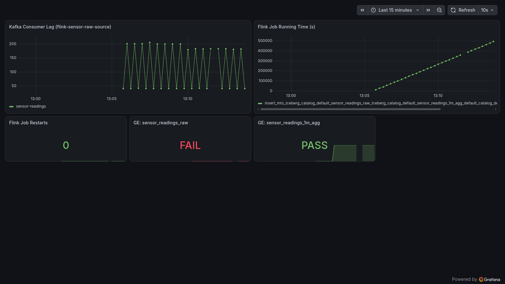
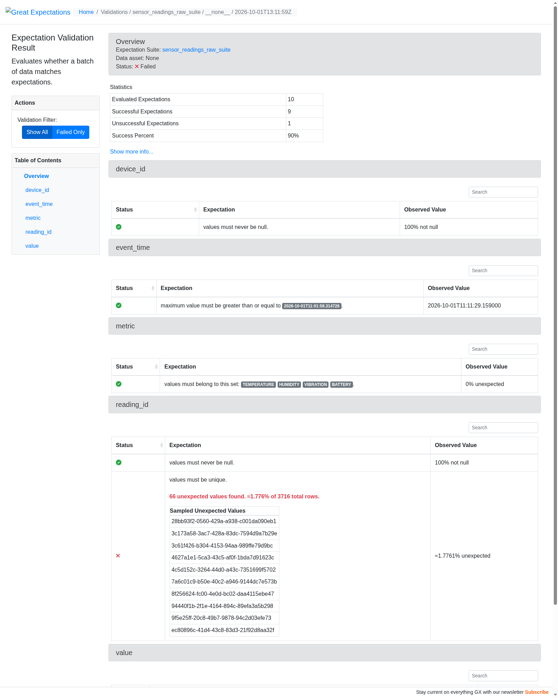

# sensor-stream-lakehouse


A streaming data pipeline for synthetic IoT sensor data: Kafka → Flink SQL → Apache Iceberg, with a formal data-quality layer (Great Expectations) and observability (Prometheus/Grafana/OpenTelemetry).

Built as a portfolio project, one milestone at a time. See open issues/PRs for progress.

## Architecture

```
sensor-generator (Python, Avro)
        │
        ▼
   Kafka + Schema Registry  (KRaft mode)
        │
        ▼
   Flink SQL job (Java, StreamTableEnvironment)
     ├─ raw passthrough  ──────────────► Iceberg: sensor_readings_raw
     ├─ 1-min tumbling window agg ─────► Iceberg: sensor_readings_1m_agg
     └─ malformed / out-of-range ──────► Kafka: sensor_readings_dlq
        │                                        (JDBC catalog + MinIO/S3)
        ▼
  Great Expectations validation (reads Iceberg via PyIceberg → pandas)
     null-rate, range, freshness/gap, duplicate-key checks → JSON/HTML report
        │
        ▼
  Prometheus + Grafana + OTel Collector
     Kafka lag, Flink job health, + GE pass/fail pushed as custom metrics
```

## Status

Work in progress — see the [issues](../../issues) for the milestone breakdown.

- [x] M1 — Ingest: docker-compose + sensor generator
- [x] M2 — Stream to lake: Flink SQL raw passthrough to Iceberg
- [x] M3 — Windowed aggregation
- [x] M4 — Dead-letter handling
- [x] M5 — Formal data quality (Great Expectations)
- [x] M6 — Observability
- [x] M7 — Polish

## What this demonstrates

- **Streaming SQL, not just batch**: Flink SQL over a `StreamTableEnvironment` doing raw passthrough, a 1-minute tumbling-window aggregation, and conditional routing to a dead-letter topic - all as one job sharing a single Kafka source scan (not three competing consumers).
- **A real lakehouse, not a toy format**: Apache Iceberg on a JDBC catalog (Postgres) + S3-compatible storage (MinIO), queryable from Flink, [PyIceberg/pandas](data_quality/), and plain SQL via [Trino](docs/querying-with-trino.md) - the same table, three different engines.
- **Data quality as code**: a Great Expectations suite (not ad hoc scripts) that's proven to actually catch bad data via synthetic test batches, and that caught a genuine gap in the live pipeline (duplicate deliveries M4's DLQ doesn't cover) - documented rather than hidden.
- **Observability without a Prometheus-scrapes-everything mess**: a single OTel Collector aggregates Kafka lag (via kafka-exporter), Flink job health (via its native Prometheus reporter), and the data-quality suite's own pass/fail (pushed via OTLP) - Prometheus only ever scrapes the collector.
- **Reproducible by design**: `docker compose up` on a bare clone builds and runs the whole pipeline, no local toolchain or manual build step required.

## Running it

**Prerequisites:** Docker + Docker Compose. No cloud account needed — Kafka, Iceberg's catalog (Postgres) and storage (MinIO) all run locally.

```
docker compose up -d --build
# or: make up
```

Stop everything with:

```
docker compose down
# or: make down
```

### Local UIs

| Service            | URL                          |
|---------------------|-------------------------------|
| Kafka UI (Kafbat)   | http://localhost:8085         |
| Flink dashboard     | http://localhost:8082         |
| MinIO console        | http://localhost:9001         |
| Schema Registry     | http://localhost:8081/subjects |
| Prometheus          | http://localhost:9090         |
| Grafana (admin/admin) | http://localhost:3000       |

Want to query the Iceberg tables with real SQL instead of scripts? See
[docs/querying-with-trino.md](docs/querying-with-trino.md) for a local Trino setup.

Data quality checks (Great Expectations) live in
[data_quality/](data_quality/README.md).

## Screenshots

Grafana dashboard - Kafka consumer lag, Flink job running time, restarts,
and live GE checkpoint pass/fail per table:



A Great Expectations validation result - this run genuinely failed,
catching real duplicate deliveries in `sensor_readings_raw` (see
[data_quality/README.md](data_quality/README.md#known-finding)):



## License

MIT
